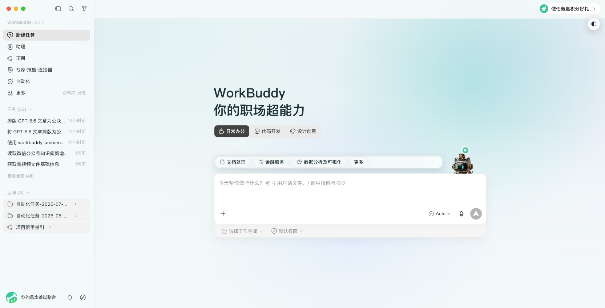
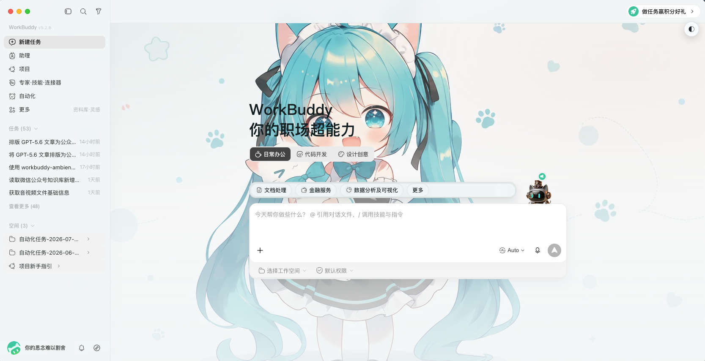
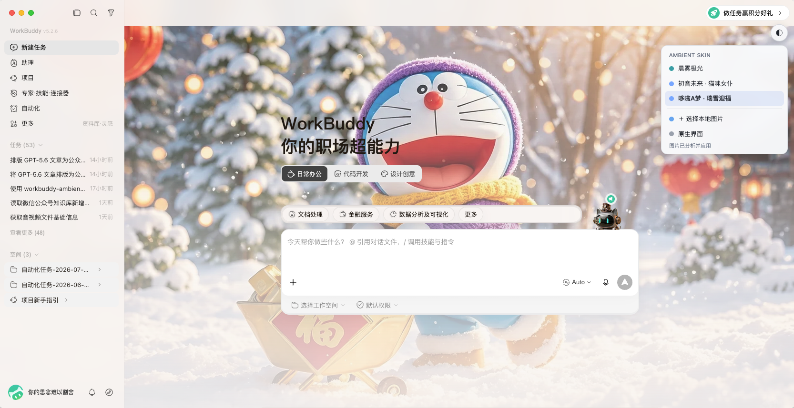
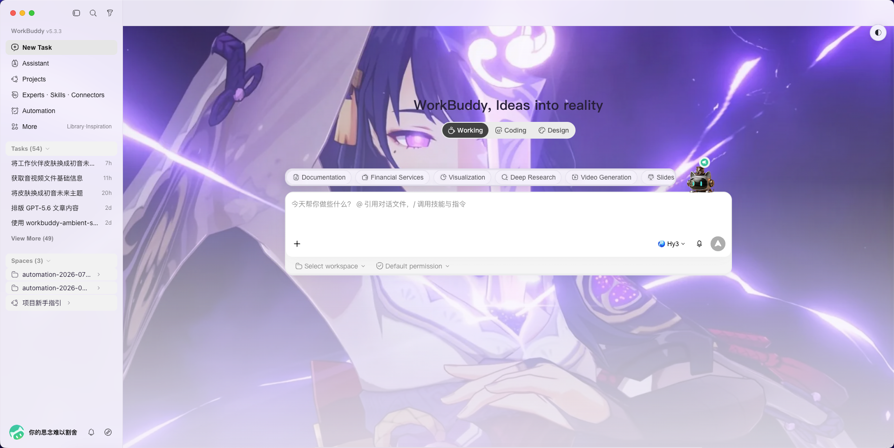

# WorkBuddy Ambient Skin

WorkBuddy 不必一直是一块灰色的工作面板。

Ambient Skin 让首页留住一张你喜欢的画面；进入对话、任务或详情后，背景会自动安静下来。侧栏、输入框和菜单仍是 WorkBuddy 原来的样子，变化的只是工作空间的光线、颜色和气氛。

> 非腾讯官方产品。支持 macOS 与 Windows，不修改 WorkBuddy 应用、`app.asar` 或应用签名。

## 内置主题

以下预览均为 WorkBuddy 实际应用主题后的界面效果。

### 晨雾极光 / Paper Aurora

浅灰与冰蓝组成的通透办公主题。背景由原创 CSS 渐变生成，聊天区保持克制，适合文档与日常工作。

<p align="center">
  <br>
  <sub>浅色 · 原创渐变 · 真实 WorkBuddy 注入效果</sub>
</p>

```shell
# macOS
"$HOME/.workbuddy/skills/workbuddy-ambient-skin/scripts/apply.command" --theme paper-aurora

# Windows PowerShell
& "$HOME\.workbuddy\skills\workbuddy-ambient-skin\scripts\workbuddy-ambient.ps1" terminal-apply --theme paper-aurora --restart confirmed
```

### 初音未来 · 猫咪女仆 / Miku Neko Maid

青色、柔白与轻粉构成的明亮主题。OKLCH 引擎会从图片自动生成界面配色，适合首页展示与轻松工作。

<p align="center">
  <br>
  <sub>青色明亮 · 自动取色 · 真实 WorkBuddy 注入效果</sub>
</p>

```shell
# macOS
"$HOME/.workbuddy/skills/workbuddy-ambient-skin/scripts/apply.command" --theme miku-neko-maid

# Windows PowerShell
& "$HOME\.workbuddy\skills\workbuddy-ambient-skin\scripts\workbuddy-ambient.ps1" terminal-apply --theme miku-neko-maid --restart confirmed
```

### 哆啦A梦 · 瑞雪迎福 / Doraemon Snow Fortune

冰雪蓝、灯笼红与暖金光线构成的节日主题。工作页和详情页会自动降低壁纸强度，兼顾氛围与阅读。

<p align="center">
  <br>
  <sub>冬日暖金 · 自动取色 · 真实 WorkBuddy 注入效果</sub>
</p>

```shell
# macOS
"$HOME/.workbuddy/skills/workbuddy-ambient-skin/scripts/apply.command" --theme doraemon-snow-fortune

# Windows PowerShell
& "$HOME\.workbuddy\skills\workbuddy-ambient-skin\scripts\workbuddy-ambient.ps1" terminal-apply --theme doraemon-snow-fortune --restart confirmed
```

### 雷神 · 雷寂永恒 / Raiden · Eternal Thunder

此间寂灭，万雷归宗。一眼惊鸿，一剑封神。深紫雷光搭配浅薰衣草玻璃界面，侧栏与卡片保持明亮清晰；工作页会主动压低壁纸强度，兼顾氛围和文字阅读。

<p align="center">
  <br>
  <sub>深紫雷光 · 浅紫玻璃 · 真实 WorkBuddy 注入效果</sub>
</p>

```bash
"$HOME/.workbuddy/skills/workbuddy-ambient-skin/scripts/apply.command" --theme genshin-raiden-shogun
```

```powershell
& "$HOME\.workbuddy\skills\workbuddy-ambient-skin\scripts\workbuddy-ambient.ps1" terminal-apply --theme genshin-raiden-shogun --restart confirmed
```

三套角色主题使用项目维护者提供的图片。角色及素材相关权利归相应权利方所有；公开分发前请确认素材授权范围。

## 它改变什么

- **改空间，不改控件**：保留原生交互，用 Material Layer 分别处理顶栏、侧栏、卡片、输入框和详情区。
- **整站覆盖，不是只改首页**：侧栏每个入口、以及「专家·技能·连接器」这类页面里的**每个 Tab**，白底都会换成玻璃——包括内容卡片海（技能 / 连接器 / 专家 / 灵感 / 我的文件 / 资料库 / 乐享知识库）。
- **知道什么时候收敛**：首页完整呈现，工作页降低对比度，详情页进一步淡出。
- **看得懂你的图片**：用 OKLCH 感知色彩提取主色与差异化辅色，并判断明暗、视觉焦点和文字安全区。
- **随时换，也随时退**：右上角切换主题；暂停或完整恢复都不碰官方安装文件。

## 一分钟开始

如果你在支持 Skill 的 AI 中使用它，直接说：

> 使用 `workbuddy-ambient-skin` 给我的 WorkBuddy 换一个安静的皮肤。

AI 会按 [SKILL.md](SKILL.md) 检查环境、推荐主题，并显示可直接复制的命令；重启操作只会在你自己的 Terminal 或 PowerShell 中发生。

手动使用：

**macOS**

```bash
"$HOME/.workbuddy/skills/workbuddy-ambient-skin/scripts/workbuddy-ambient.sh" doctor
"$HOME/.workbuddy/skills/workbuddy-ambient-skin/scripts/workbuddy-ambient.sh" list
"$HOME/.workbuddy/skills/workbuddy-ambient-skin/scripts/apply.command" --theme paper-aurora
```

**Windows PowerShell**

```powershell
& "$HOME\.workbuddy\skills\workbuddy-ambient-skin\scripts\workbuddy-ambient.ps1" doctor
& "$HOME\.workbuddy\skills\workbuddy-ambient-skin\scripts\workbuddy-ambient.ps1" list
& "$HOME\.workbuddy\skills\workbuddy-ambient-skin\scripts\workbuddy-ambient.ps1" terminal-apply --theme paper-aurora --restart confirmed
```

`doctor` 检查环境，`list` 查看可用主题，最后一条命令应用主题。应用命令会重启 WorkBuddy，请先保存未完成的输入。

> Skill 不会从 WorkBuddy 的 Agent 沙箱中自动关闭或重启 WorkBuddy，也不会使用 AppleScript、LaunchServices 或后台 worker 绕过系统权限。

## 快捷启动器（Windows 图形界面）

同时装了**国内版**和**国际版** WorkBuddy 时，两条链路各自要带不同的调试端口，手动敲命令容易搞混。双击桌面上的 **`启动美化.bat`** 会弹出一个窗口，把两个版本收在一处：

| 位置 | 说明 |
|---|---|
| 路径配置 | 两个版本各一条路径。**留空就自动探测**（注册表 / 常见安装位置 / 正在运行的进程），也可以点「浏览」手工指定，或用「自动」回到自动探测 |
| 启动国内版 | 绿色按钮。启动 `WorkBuddy.exe`，带上它自己的 CDP 端口 |
| 启动国际版 | 紫色按钮。启动 `WorkBuddyAI.exe` |
| 自动注入皮肤 | 勾上则在 CDP 就绪后立刻把皮肤注入进去，省掉再跑一次「一键美化」 |
| 自动关闭本窗口 | 勾上则**启动成功后**窗口自己关掉（默认勾选） |

几条它替你处理的细节：

- **「启动成功」的判据是调试端口真的通了**，不是"进程拉起来了"。因为后续注入和自愈全靠这个端口，端口不通等于白启动。所以窗口会在成功后**再等一下**，确认真通了才关闭。
- **已经在带调试端口运行的实例不会被重启**。这样不会平白丢掉当前对话上下文。
- 被启动的实例如果原本是普通双击打开的（没带调试端口），会先被关掉再带参重启 —— 否则单实例锁会让新实例起不来，表现为"点了没反应"。
- 路径框里显示的是**实际会用的路径**，旁边一行小字标出「自动探测 / 手工指定」+ 进程数 + 端口号，一眼能确认启的是哪个版本。
- 启动/注入的完整日志都在窗口里，也写进 `%LOCALAPPDATA%\WorkBuddyAmbientSkin\launcher.log`。

> `启动美化.bat` 需要**带 tkinter 的 Python**。WorkBuddy 自带的 Python 是精简版、不含 tkinter，所以这个 bat 会自动去找系统安装的 Python 3.11+。没装的话它会提示你去 python.org 下载（安装时勾选 "tcl/tk and IDLE"）。
>
> 想看到报错细节，改双击 **`启动美化-调试.bat`**（保留控制台窗口）。

### 已打包版本

如果不想依赖 Python，可以直接使用打包产物：

- **`WorkBuddy美化启动器.exe`**：单文件版，复制这一个 exe 即可，首次启动会解压几秒；
- **`WorkBuddy美化启动器-文件夹`**：文件夹版，启动更快，但必须整体复制文件夹。

两种版本都已经把技能目录下需要的脚本、完整 `scripts/lib`、CSS/JS、主题、预览图、
测试和文档一起放进包里，启动时不需要再从旁边找 `inject.py` 或 `ambient.css`。
双击时会先确认包内素材、加载注入器，再创建界面；如果初始化异常，会写入
`%LOCALAPPDATA%\WorkBuddyAmbientSkin\launcher-error.log`。

## 日常动作

皮肤激活后，常用的管理命令：

**macOS**

```bash
scripts/workbuddy-ambient.sh switch --theme THEME_ID   # 即时切换
scripts/workbuddy-ambient.sh status                     # 查看状态
scripts/workbuddy-ambient.sh pause                      # 暂停皮肤
scripts/workbuddy-ambient.sh restore --restart confirmed # 完整恢复
```

**Windows PowerShell**

```powershell
& "$HOME\.workbuddy\skills\workbuddy-ambient-skin\scripts\workbuddy-ambient.ps1" switch --theme THEME_ID
& "$HOME\.workbuddy\skills\workbuddy-ambient-skin\scripts\workbuddy-ambient.ps1" status
& "$HOME\.workbuddy\skills\workbuddy-ambient-skin\scripts\workbuddy-ambient.ps1" pause
& "$HOME\.workbuddy\skills\workbuddy-ambient-skin\scripts\workbuddy-ambient.ps1" restore --restart confirmed
```

`switch` 和 `pause` 需要当前皮肤会话仍在运行。WorkBuddy 完全退出后，再次执行完整 apply 命令即可。

## 把自己的图片带进来

应用皮肤后，WorkBuddy 会出现一个可拖动的 `◐` 氛围浮球。点击它可以切换内置主题、选择本地图片，或暂时回到“原生界面”；按住拖动可调整位置，松手后会吸附到最近的左右边缘并记住位置，双击可复位到右上角。菜单会根据浮球位置自动选择展开方向。

菜单中的“调整氛围”可以实时修改当前主题的壁纸强度、玻璃面板、背景模糊、亮度和饱和度。每套主题单独保存自己的参数，不会修改主题文件；“恢复推荐值”可随时回到主题作者提供的默认效果。为保证文字可读性，玻璃面板的可调范围限制在 72%–98%。

菜单中的“生成主题收藏卡”会把当前主题制作成一张 `1600 × 900` 的玻璃风格 PNG。标题和一句话描述可以在预览中修改；背景构图、亮度、饱和度、主题色板与氛围关键词会自动带入。整个过程只使用本地 Canvas，不截取 WorkBuddy 页面，也不会包含聊天或任务内容。

选择图片后，Ambient Skin 会在本机完成分析：

- 根据感知亮度中位数选择深色或浅色界面；
- 在 OKLCH 空间提取主色，并选择有足够色相距离的辅色；
- 自动校正强调色与文字色的对比度；
- 避开主体区域放置内容，并保留合适的背景焦点；
- 将图片缩放为最大边 1600px 的 WebP，减少常驻开销。

菜单最多保留最近 8 张图片。每张图片右侧的 `✎` 可以直接展开名称编辑器，`×` 会展开删除确认；两者都在菜单内完成，不依赖系统弹窗。重命名不会重新分析图片。

通过命令管理图片主题：

```bash
scripts/workbuddy-ambient.sh create --image "/absolute/path/background.webp" --name "My Theme"
scripts/workbuddy-ambient.sh rename --theme THEME_ID --name "新名称"
scripts/workbuddy-ambient.sh delete --theme THEME_ID --confirm yes
```

命令行删除采用可恢复移除，文件会转移到本机的 `deleted-themes` 目录。内置主题不能删除或重命名。

支持 PNG、JPEG、WebP，单张不超过 15 MB、5000 万像素。纯背景图通常比带文字、按钮或界面截图的图片更自然。

## 让背景动起来（视频背景）

除了静态壁纸，还可以把**本机的一段视频**当作背景。它是一层独立的开关，叠加在现有主题之上，不影响任何内置主题。

在 `◐` 菜单底部的「视频背景」区点一下 **「＋ 选择本地视频」**，像选图片一样挑一个本机视频文件就行，不用敲路径。选中后按钮会变成 `已选：xxx.mp4`，右边有一个 `×` 用来清掉重选。亮度、模糊、缩放都会记在本机。

> **重启后需要重新选一次。** WorkBuddy 只把文件临时借给页面用（浏览器安全限制，页面拿不到文件的真实路径），所以重启之后旧引用会失效。菜单会明确提示「「xxx.mp4」重启后需要重新选择」，点一下重选即可，缩放的参数不会丢。

熟悉命令行的话也可以直接指定路径，效果一样：

```bash
# 开启
python scripts/inject.py --port 9348 --video "D:/videos/bg.mp4"

# 关闭，恢复静态壁纸
python scripts/inject.py --port 9348 --video-off
```

命令行走的是真实路径，**重启后依然有效**，适合固定不变的背景视频。手输路径的入口在菜单里折叠成了「手动填路径」，需要时再展开。

**路径请用 Windows 盘符写法**（`D:/videos/bg.mp4`）。Git Bash 风格的 `/d/videos/bg.mp4` 不是合法的 Windows 路径，浏览器会直接报格式错误；`D:\videos\bg.mp4` 和 `file:///D:/videos/bg.mp4` 也都接受。

视频会静音循环播放，自动铺满窗口且不响应鼠标，因此不会挡住任何点击。为了不让两层背景互相干扰，视频开启时静态壁纸会让位；关闭后自动恢复。支持浏览器能解码的格式（常见为 MP4 / WebM），单个文件建议不超过 2 GB。

### 播放流畅度

视频作为独立图层交给了显卡合成，聊天界面滚动、重绘时不会带着视频一起卡。此外还做了几件事：

- 窗口切到后台再切回来、或从最小化恢复时，会自动接上播放（Chromium 会在这类情况下悄悄暂停视频，且不报错）
- 播放状态实时显示在菜单里：`正在加载…` / `播放中` / `缓冲中…`；解码不了会给出具体错误码
- 自动播放如果被拦住，只在第一次提示，不会反复弹

如果视频仍然卡，通常是文件本身码率过高或分辨率远大于屏幕。可以先用「视频缩放」调一下，或者换一个码率低一些、分辨率接近屏幕的版本；也可以先用「视频模糊」压一压细节——模糊是在显卡上算的，几乎不额外花钱。

## 改首页那句话（首页文字）

首页顶上那句「WorkBuddy, 我帮你」，以及下面两个按钮的文字，都可以换成你自己的。菜单里往下拉到 **「首页文字」**：

| 位置 | 说明 |
|------|------|
| 主标题 | 首页最大的那行字 |
| 副标题 | 主标题下面一行小字。原生是空的，填了才会出现 |
| 按钮一 | 左边那个按钮（原生「日常办公」） |
| 按钮二 | 右边那个按钮（原生「代码开发」） |

**边打边生效**，不用点保存。想回到官方文案，点右上角的 **「恢复默认」**，或者把某一项清空——留空就是「用原生文案」的意思，所以只改其中一项也没问题。

几个说明：

- **只改显示的文字，不动按钮功能。** 按钮上的图标、点击后切换的模式都保持原样。
- 文字改长一点也没关系，按钮会自己适应宽度；太长会用省略号截断，不会把布局撑坏。
- 设置记在本机，重开还在。
- 停用皮肤时首页会自动变回官方文案，不会留一句你改过的字。

## Windows 稳定安装

如果不想依赖仓库路径，可将运行时安装到 `%LOCALAPPDATA%\WorkBuddyAmbientSkin\engine`，并创建快捷方式：

```powershell
powershell -NoLogo -NoProfile -ExecutionPolicy RemoteSigned -File "$HOME\.workbuddy\skills\workbuddy-ambient-skin\scripts\install-windows.ps1"
```

安装器先写入临时目录，验证后再替换旧版本；更新失败会恢复原版本。不需要快捷方式时加 `-NoShortcuts`。不会注册开机自启、常驻托盘或后台服务。

## 保持原生的边界

Ambient Skin 通过仅绑定 `127.0.0.1` 的 Chrome DevTools Protocol 找到 WorkBuddy 渲染页，注入主题变量、背景样式和一个隔离的 Shadow DOM 菜单。它不重写页面业务逻辑，也没有 npm 运行时依赖。

这套方式有意保持轻量，但也有明确边界：

- 皮肤会话开启时，不要运行来源不明的本地程序；
- 支持 macOS 13+ 与 Windows 10/11，两端均需 Node.js 22+；
- Ambient Skin 固定使用 CDP 端口 `9347`；端口被占用时会明确报错；
- 一次 `--restart confirmed` 授权一个有界的重启事务：精准结束 WorkBuddy 进程族（macOS 持续复核 App 包内的完整进程族包括退出期间新出现的 helper；Windows 以完整可执行路径做同样清理，不会误伤其他应用），用 CDP 启动一次并注入皮肤。若启动或注入失败不会循环重启，保留原始错误和启动日志；
- 脚本不会在没有 `--restart confirmed` 时关闭应用，避免意外丢失内容；
- WorkBuddy 若调整关键 DOM 或 `--cb-*` 变量，适配层可能需要更新；
- "完整恢复"会重启 WorkBuddy，并关闭用于皮肤会话的 CDP。

开发验证使用 `npm test` 和 `npm run check`。自定义主题格式见 [references/theme-schema.md](references/theme-schema.md)。

## 感谢

本项目参考了 [Codex Dream Skin](https://github.com/Fei-Away/Codex-Dream-Skin) 的换肤设计理念，感谢其提供的创意启发。

## 开源协议

[MIT](LICENSE) © 2026 leeandrew94

任何人都可以自由使用、**修改**、再分发、商用，包括闭源二次开发。
唯一的条件是：在你的副本或重要部分里保留上面的版权声明和许可声明。

> 简单说：随便改、随便发，别把版权声明删了就行。
